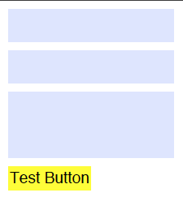

# AcroForms in PDFKit

AcroForms are interactive features of the PDF format, and they make it possible
to include things like text fields, buttons and actions. To include AcroForms
you must call the document `initForms()` method.

- `initForms()` - Must be called when using AcroForms

## AcroForm Methods

AcroForm elements are _Widget Annotations_ and are added using the
`widgetAnnotation` method. Additional methods listed below are shortcut methods
that call the `widgetAnnotation` method. The list of the available _Widget
Annotation_ document methods is:

- `widgetAnnotation( name, x, y, width, height, options)`
- `formText( name, x, y, width, height, options)`
- `formPushButton( name, x, y, width, height, name, options)`
- `formRadioButton( name, x, y, width, height, options)`
- `formNoToggleToOffButton( name, x, y, width, height, options)`
- `formChoice( name, x, y, width, height, options)`

### Options Parameter

Some Widget Annotations have a `color` option that can be specified. You can use
an array of RGB values, a hex color, or a named CSS color value for that option.

- `backgroundColor` - button background color
- `borderColor` - button border color

Other `options` conveniences include:

- `label` - set button text labels (will set <<MK <<CA (label)>> >>)
- `align` - set to `left`, `center` or `right` for text within the
  Widget Annotation
- Field flags that will set bits in `Ff`
  - `readyOnly`: 1,
  - `required`: 2,
  - `noExport`: 4,
  - `multiline`: 0x1000,
  - `password`: 0x2000,
  - `toggleToOffButton`: 0x4000, (will be set when calling the `formNoToggleToOffButton` method)
  - `radioButton`: 0x8000, (will be set when calling the `formRadioButton` method)
  - `pushButton`: 0x10000 (will be set when calling the `formPushButton` method)
  - `combo`: 0x20000,
  - `edit`: 0x40000,
  - `sort`: 0x80000

When using the `formChoice` method, set `options.Opt` to the array of choices.

When needing to format the text value of a Widget Annotation, the following
`options` shortcuts are available to implement predefined JavaScript actions.
Refer to the Acrobat SDK documentation for the [Acrobat Forms
Plugin](https://help.adobe.com/en_US/acrobat/acrobat_dc_sdk/2015/HTMLHelp/#t=Acro12_MasterBook%2FIAC_API_FormsIntro%2FMethods1.htm) for more information.

- `format` - object
  - `type` - value is a string with one of the following values:
    - `time`
    - `date`
    - `percent`
    - `number`
    - `special`
    - `zip`
    - `zipPlus4`
    - `phone`
    - `ssn`
  - `params` - value is a string, number or array of strings and numbers

## Other Methods

The font used for a Widget Annotation is set using the `document.font` method.
Yes that's the same method as is used when setting the text font.

Widget Annotations are, by default, added to the Catalog's `AcroForm` dictionary
as an array of `Fields`. Fields are organized in a name heirarchy, for example
_shipping.address.street_. You can either set the `name` of each Widget
Annotation with the full name (e.g. _shipping.address.street_) or you can create
parent Fields. In this example you might have a _shipping_ field that is added
to the AcroForm Fields array, an _address_ field that refers to the _shipping_
Field as it's parent, and a _street_ Widget Annotation that would refer to the
_address_ field as it's parent. To create a field use the document method:

- `field( name, options )` - returns a reference to the field

To specify the parent of a _Field_ or _Widget Annotation_, set the `parent`
options to the field reference.

```js
var shippingRef = doc.field( 'shipping' );
var addressRef = doc.field( 'address', shippingRef );
doc.formText('street`,10,10,100,20,{parent:addressRef});
```

In support of Widget Annotations that execute PDF JavaScript, you can call the following document method:

- `addNamedJavaScript( name, buffer )`

## Limitations

An important caveat when using AcroForms with PDFKit is that form elements must
each have an _appearance_ set using the `AP` attribute of the annotation. If
this attribute is not set, the form element _may_ not be visible. Because
appearances can be complex to generate, Adobe Acrobat has an option to build
these apperances from form values and Widget Annotation attributes when a PDF is
opened. To do this PDFKit sets the AcroForm dictionary's `NeedAppearances`
attribute to true. This could mean that the PDF will be _dirty_ upon open,
meaning it will need to be saved. It is also important to realize that the
`NeedAppearances` flag may not be honored by PDF viewers that do not implement
this aspect of the PDF Reference.

A final note on `NeedAppearances` is that for some form documents you may not
need to generate appearances. This may be the case for text Widget Annotations
that are initially blank. This is not true for push button widget annotations.

---

Here is an example that uses field hierarchy, adds three text fields and a push
button.

```javascript
doc.font('Helvetica'); // establishes the default font
doc.initForms();

let rootField = doc.field('rootField');
let child1Field = doc.field('child1Field', { Parent: rootField });
let child2Field = doc.field('child2Field', { Parent: rootField });
doc.formText('leaf1', 10, 10, 200, 40, {
  Parent: child1Field,
  multiline: true
});
doc.formText('leaf2', 10, 60, 200, 40, {
  Parent: child1Field,
  multiline: true
});
doc.formText('leaf3', 10, 110, 200, 80, {
  Parent: child2Field,
  multiline: true
});

var opts = {
  backgroundColor: 'yellow',
  label: 'Test Button'
};
doc.formPushButton('btn1', 10, 200, 100, 30, opts);
```

The output of this example looks like this.


